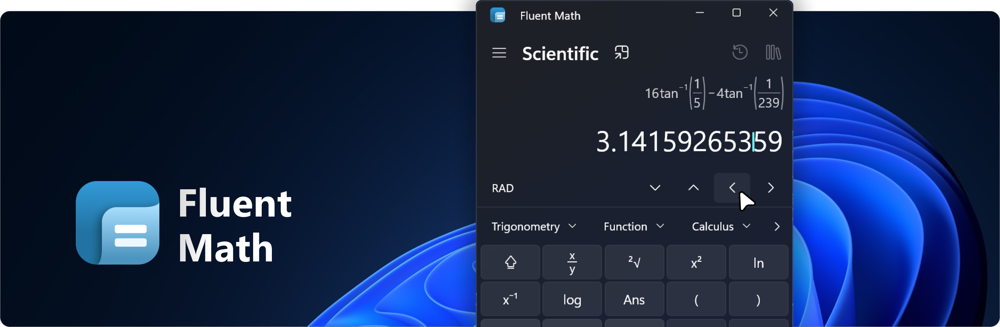

###

<p align="left">
  <a href="https://github.com/cechout/fluent-math/releases/latest"></a>
  <a href="https://github.com/cechout/fluent-math/releases"></a>
  <a href="https://github.com/cechout/fluent-math/releases"></a>
</p>

###

Fluent Math is a native Windows 11 application built with C# and WinUI 3. The goal is to provide an alternative to the default Windows Calculator. While the Windows Calculator evaluates inputs step-by-step, this app works like a real physical calculator: you type the entire equation first and press `=` to calculate the final result.

## ✨ Features

* **Standard and Scientific Calculator:** Both take the whole expression and evaluate it on `=`. The scientific one adds fractions, roots, powers, trigonometry, logarithms, number theory, probability, calculus and decimal prefixes, measured against a Casio fx-87DE X, and shows results exactly as fractions, roots, multiples of π or recurring decimals.
* **Converters:** Currency, volume and length, and either line takes the input. The currency converter uses the daily reference rates of the European Central Bank and keeps the last ones for offline use.
* **Compact Mode:** Any calculator or converter page shrinks into a small window that stays on top of every other one.

## 📦 Download

* **[Microsoft Store](https://apps.microsoft.com/detail/9MW5DCS70PWS):** installs and updates through the Store.
* **Installer** (`FluentMath_Installer.exe`): installs into `Program Files` with a start menu entry and an uninstaller.
* **Portable** (`FluentMath_Portable_<version>.zip`): unzip anywhere and run `FluentMath.exe`. Settings stay in a `Persistence` folder next to it, so deleting the folder removes every trace.

Installer and portable are on the [releases page](https://github.com/cechout/fluent-math/releases) and update themselves from inside the app. Every build runs on Windows 10 and 11 (x64) and needs no administrator rights to run.

## 🔒 Privacy

The app collects nothing, has no telemetry and no account. It only goes online for the exchange rates of the currency converter and for updates: to check whether a newer version exists and to load the release notes. One switch in the settings keeps it from checking for updates on its own. [PRIVACY.md](PRIVACY.md) explains exactly what is sent and when.

## 🛠️ How to Build

### 1. Prerequisites
To build and run this project, it is highly recommended to use **Visual Studio 2022** (Version 17.13 or later, for the `.slnx` solution) or **Visual Studio 2026**.
Before opening the solution, make sure you have the following workloads installed via the **Visual Studio Installer**:

* **.NET desktop development**
* **WinUI application development** (Make sure that ".NET WinUI app development tools" is checked in the optional components on the right side).

### 2. Clone the Repository
```ps
git clone https://github.com/cechout/fluent-math.git
```

### 3. Build and Run
* Open `FluentMath.slnx`.
* Right-click on `FluentMath` in the Solution Explorer and select `Set as Startup Project`.
* In the top toolbar, set the Solution Platform to `x64` and the launch profile to `FluentMath (Unpackaged)`. *Note: WinUI 3 projects do not support 'Any CPU' builds.*
* Press `F5` to build and run the application.

Building from the command line works with `dotnet build`; [AGENTS.md](../AGENTS.md) has the exact commands.

And now you're good to go!
